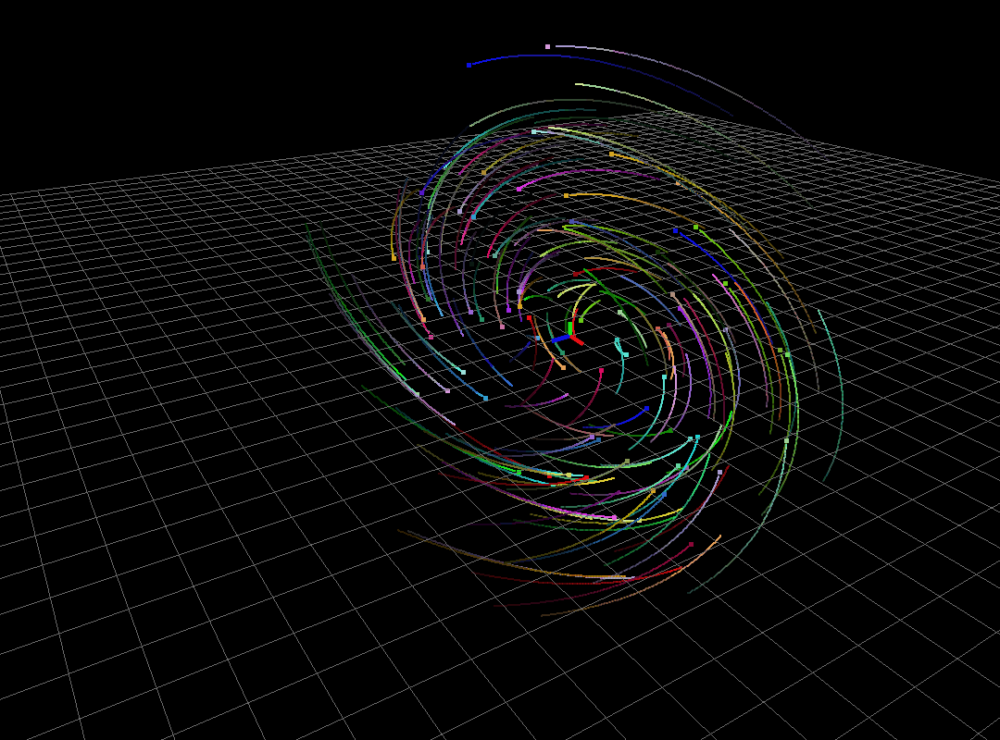

# Linear Controls

Implementation of linear controls as part of **EE60011: Control Theory** course at IIT Kharagpur by [Prof. Sanand](http://www.facweb.iitkgp.ac.in/~sanand/f_sanand.html)

<div class="fig figcenter fighighlight">
  
  
</div> 

**Fig1:** **Left**: Marginally stable system. **Right**: Exponentially stable system.

## TODO
- [x] 3D rendering using OpenGL
- [x] Continuous/Discrete Linear Time Invariant Systems
- [x] Particle rendering with different initial conditions
- [x] Rendering particles lifetime
- [x] Efficient rendering of particles [**use instance buffers**]
- [ ] Non-linear systems (pendulum/inverted pendulum as simple examples)
- [x] SISO pole placement
- [ ] MIMO pole placement

## Requirements

- cmake 3.3+
- C++14 (g++-5.4.0)
- OpenGL 3.3+
- Eigen3
- gl3w

## Usage

1. After cloning the repository, you need to add the dependencies. Specifically `gl3w` files. Checkout [this](https://github.com/skaslev/gl3w) on how to generate `gl3w.h` `glcorearb.h` and `gl3w.c` files. Place the headers under `include/controls/ext/gl3w` directory. Structure should look something like:

```
include/
  controls/
    ext/
      gl3w/
        - gl3w.h
        - glcorearb.h
```
... and place `gl3w.c` under `src/`.

### Build

**Note**: Built in Debug mode, to change to Release, check `CMakeLists.txt`

```bash
git clone git@github.com:kvmanohar22/controls.git
cd controls
mkdir build
cd build
cmake ..
```

### Test linear controller
```bash
cd /path/to/build
make test_linear
./test_linear
```
Use `W S A D` keys to move the camera and mouse to change yaw and pitch angles.

### Test SISO pole placement
```bash
cd /path/to/build
make test_siso
./test_siso
```

For more details checkout [https://kvmanohar22.github.io/controls](https://kvmanohar22.github.io/controls)
