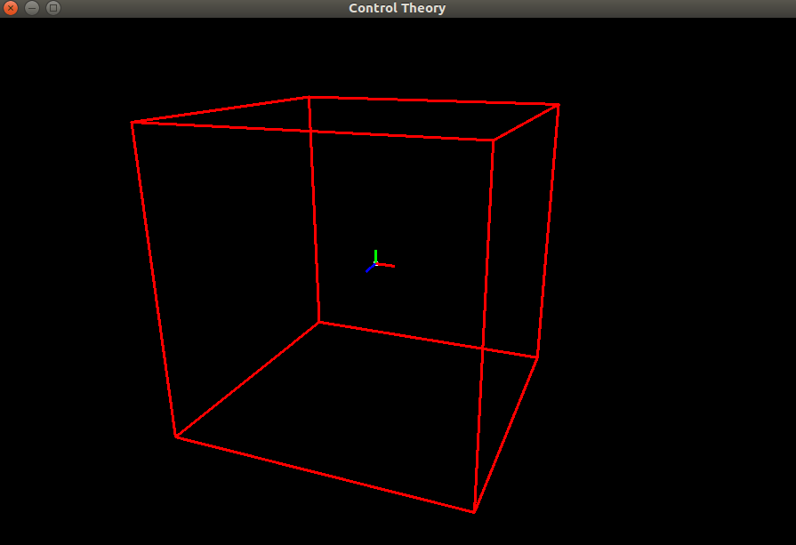

# Linear Controls

Implementation of linear controls as part of **EE60011: Control Theory** course at IIT Kharagpur by [Prof. Sanand](http://www.facweb.iitkgp.ac.in/~sanand/f_sanand.html)

## TODO
- [x] 3D rendering using OpenGL
- [x] Continuous/Discrete Linear Time Invariant Systems
- [x] Particle rendering with different initial conditions
- [ ] Rendering particles lifetime
- [ ] Continuous/Discrete Linear Time Variant Systems
- [ ] Non-linear systems (pendulum/inverted pendulum as simple examples)
- [ ] MIMO pole placement
- [ ] State evolution of controllable/un-controllable observable/un-observable systems
- [ ] Static/Dynamic output/state feedback systems

