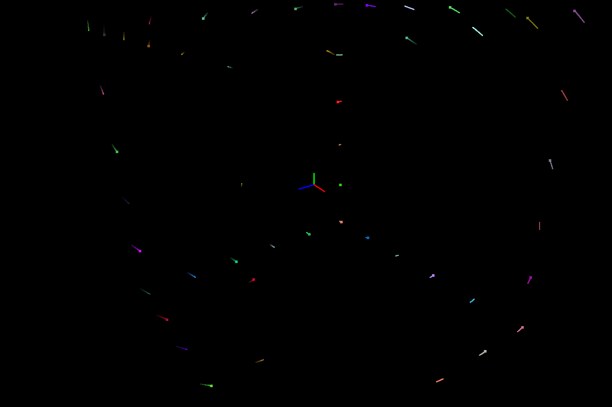

# Linear Controls

Implementation of linear controls as part of **EE60011: Control Theory** course at IIT Kharagpur by [Prof. Sanand](http://www.facweb.iitkgp.ac.in/~sanand/f_sanand.html)

<div class="fig figcenter fighighlight">
  
  
</div> 

**Fig1:** Rendering of evolution of particles with eigenvalues `(-0.43016,2.61428) (-0.43016,-2.61428),(-1.13968, 0)` on the left and `(0.440736,0)  (-1.22037,2.75435) (-1.22037,-2.75435)` on the right. Note that, for the rendering on the left, real part of complex eigenvalues is strictly less than zero and hence (exponentially) stable but for the ones on the right, real part of complex eigenvalues is positive and hence the particles shoot to infinity exponentially fast.

## TODO
- [x] 3D rendering using OpenGL
- [x] Continuous/Discrete Linear Time Invariant Systems
- [x] Particle rendering with different initial conditions
- [x] Rendering particles lifetime
- [x] Efficient rendering of particles [**use instance buffers**]
- [ ] Non-linear systems (pendulum/inverted pendulum as simple examples)
- [x] SISO pole placement
- [ ] MIMO pole placement
- [ ] State evolution of controllable/un-controllable observable/un-observable systems
- [ ] Static/Dynamic output/state feedback systems

## Requirements

- C++14
- OpenGL 3.3+
- Eigen3
- glfw3
- gl3w

## Usage

### Build

**Note**: Built in Debug mode, to change to Release, check `CMakeLists.txt`

```bash
git clone git@github.com:kvmanohar22/controls.git
cd controls
mkdir build
cd build
cmake ..
```

### Test linear controller
```bash
cd /path/to/build
make test_linear
./test_linear
```

### Test SISO pole placement
```bash
cd /path/to/build
make test_siso
./test_siso
```

For more details checkout [https://kvmanohar22.github.io/controls](https://kvmanohar22.github.io/controls)
