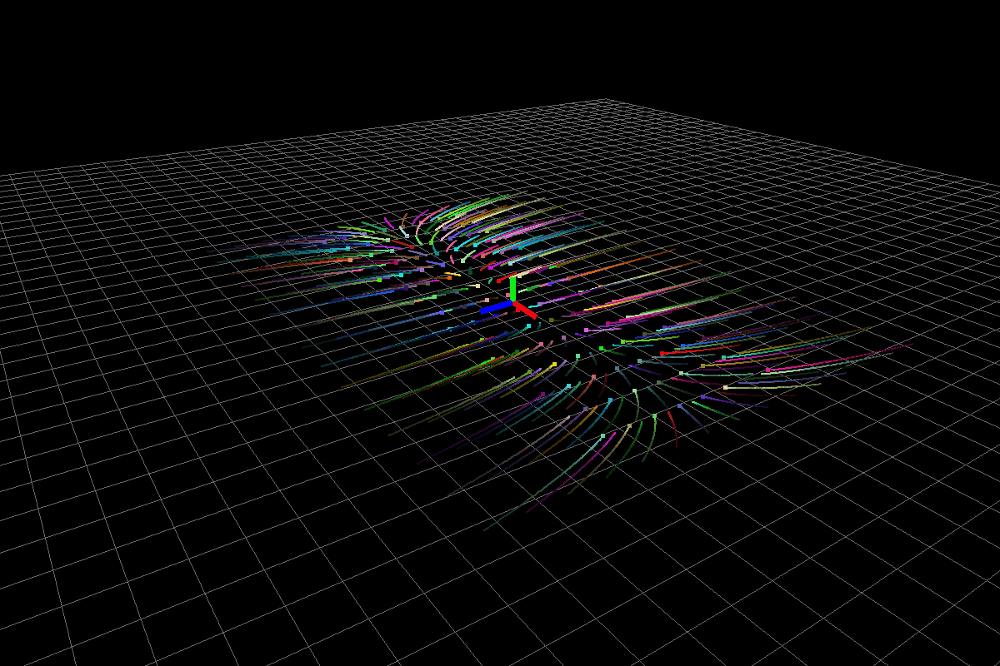

# Linear Controls

## Contents
- [Linear systems](#linear)
  - [Asymptotically stable system](#asymp)
  - [Unstable System](#unstable)
  - [Marginally Stable System](#marginal)
  - [Stable system (with negative real part complex eigenvalues)](#stable_neg)
  - [Stable system (with negative real part complex eigenvalues)](#unstable_pos)

## Linear Systems
The systems considered are continuous linear time invariant autonomous systems.

$$
\frac{d}{dt} x(t) = Ax(t)
$$

The solution to the above system being,

$$
x(t) = e^{At}x(t_0)
$$

In what follows, I present systems with different initial conditions i.e, \\(x(t_0)\\) for various eigenvalues.

### Asymptotically stable system
$$
A = 
\begin{bmatrix}
  -.5 & 0 & 0 \\ 
   0 & -2 & 0 \\ 
   0 & 0 & -3 \\ 
\end{bmatrix}
$$

The above system has eigenvalues `(-0.5,0), (-2,0), (-3,0)`.

**Fig0:** Stable system.

### Unstable system
$$
A = 
\begin{bmatrix}
  -1 & 0 & 0 \\ 
   0 & -2 & 1 \\ 
   0 & 0 & 0.5 \\ 
\end{bmatrix}
$$

The above system has eigenvalues `(-1,0), (-2,0), (0.5,0)`. Because of positivity of third eigenvalue, all the particles shoot to infinity exponentially fast.

**Fig1:** Unstable system.

### Marginally stable system
$$
A = 
\begin{bmatrix}
  -2 & 0 & 0 \\ 
   0 & 0 & -2 \\ 
   0 & 2 & 0 \\ 
\end{bmatrix}
$$

The above system has eigenvalues `(-2,0), (0,2), (0,-2)`. Because of real part being zero for third eigenvalue, \\(\lvert \lvert x(t)\rvert \rvert \\) is bounded but the system is not asymptotically stable.

**Fig2:** Marginally stable system.

### Stable system (with negative real part complex eigenvalues)
$$
A = 
\begin{bmatrix}
  0 & -2 & 0 \\ 
   2 & 0 & -2 \\ 
   0 & 2 & -2 \\ 
\end{bmatrix}
$$

The above system has eigenvalues `(-0.43016,2.61428) (-0.43016,-2.61428) (-1.13968,0)`. 

**Fig3:** Stable system

### Unstable system (with positive real part complex eigenvalues)
$$
A = 
\begin{bmatrix}
  0 & -2 & 3 \\ 
   2 & 0 & -2 \\ 
   0 & 2 & -2 \\ 
\end{bmatrix}
$$

The above system has eigenvalues `(-0.2,0)  (0.2,2.22711) (0.2,-2.22711) `.

**Fig4:** Unstable system
